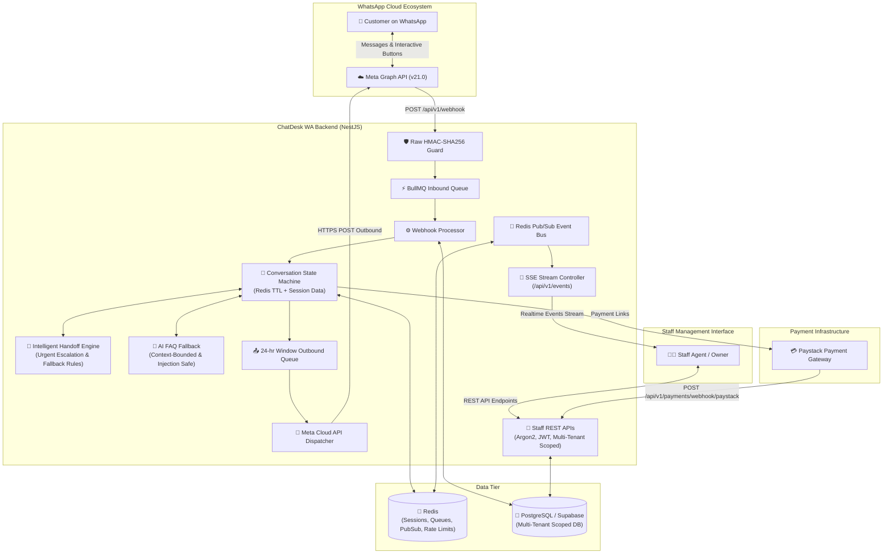

# ChatDesk WA 🚀

> **Multi-tenant WhatsApp Business Automation & Human Handoff Engine for Small Shops and Service Businesses.**

ChatDesk WA is an enterprise-grade WhatsApp Business bot and staff dashboard platform built on the **Meta WhatsApp Cloud API**, **NestJS**, **PostgreSQL (Prisma)**, **Redis**, and **BullMQ**. It empowers small businesses to automate catalog browsing, cart management, appointments, payments (Paystack), and FAQs—while offering a live staff dashboard with instant human handoff and Server-Sent Events (SSE).

---

## Architecture Diagram



---

## 🌟 Key Features

1. **Meta WhatsApp Cloud API Integration**:
   - Webhook verification challenge (`GET /api/v1/webhook`).
   - Strict `X-Hub-Signature-256` HMAC validation against raw request buffer before parsing.
   - 2-tier idempotency (Redis TTL lock + PostgreSQL unique constraint on `(businessId, waMessageId)`).
   - Enforced **24-hour Meta Customer Care Window** tracking.

2. **Conversation State Machine (Redis Session Store)**:
   - Finite states: `MAIN_MENU`, `BROWSING_CATALOG`, `CART`, `CHECKOUT`, `BOOKING_DATE`, `BOOKING_TIME`, `AWAITING_PAYMENT`, `HUMAN_HANDLING`.
   - Global commands (`menu`, `cancel`, `agent`, `stop`, `start`) work from any state.
   - Customer opt-out compliance (`STOP` auto-unsubscribes and blocks outbound messaging).

3. **E-Commerce & Digital Orders**:
   - Product catalog browsing with interactive list messages & details.
   - Redis-backed customer shopping cart (quantities, prices, subtotal calculation).
   - Order finite state machine (`PENDING` $\rightarrow$ `PAID` $\rightarrow$ `PREPARING` $\rightarrow$ `COMPLETED` / `CANCELLED`).

4. **Service Booking & Double-Booking Prevention**:
   - Multi-slot date/time appointment selector.
   - Double-booking prevention with overlap detection executed inside atomic PostgreSQL transactions.
   - Real-time slot availability calculator.

5. **Integrated Payments (Paystack)**:
   - WhatsApp payment link generator with reference tracking.
   - Idempotent `POST /api/v1/payments/webhook/paystack` receiver with HMAC-SHA512 validation.
   - Automatic order payment confirmation and WhatsApp notification dispatch.

6. **Human Handoff & Realtime Staff Dashboard**:
   - Live Server-Sent Events stream (`GET /api/v1/events`) backed by distributed Redis Pub/Sub.
   - Rule-based handoff on keywords, button actions, urgent keyword escalation (`fraud`, `emergency`, `lawsuit`), and consecutive unhandled queries (threshold: 3).
   - Business operating hours awareness with automated after-hours responses.
   - Multi-tenant staff authentication (Argon2id, rotating refresh cookies, login brute-force rate limiting).

7. **Context-Bounded AI FAQ Fallback (Feature Flagged)**:
   - Feature flag `AI_FAQ_ENABLED=true`.
   - Answers customer questions exclusively from verified business FAQ records.
   - Prompt-injection defense: strict delimiter isolation (`<customer_query>`) and zero-hallucination policies.

---

## 🛠️ Technology Stack

- **Runtime & Language**: Node.js 20, TypeScript (Strict Mode)
- **Framework**: NestJS 10
- **Database & ORM**: PostgreSQL via Prisma ORM (Supabase-ready)
- **Caching & Message Broker**: Redis 7, BullMQ
- **Authentication**: Passport JWT, Argon2id, Secure HttpOnly Cookies
- **Testing**: Jest, Supertest (30 test suites, 120+ tests)
- **Documentation**: Swagger OpenAPI (`/docs`), `docs/API_CONTRACT.md`
- **CI/CD**: GitHub Actions

---

## 🚀 Quick Start (Local Development)

### 1. Prerequisites
- [Node.js 20 LTS](https://nodejs.org/)
- [Docker Desktop](https://www.docker.com/products/docker-desktop/) (for local PostgreSQL & Redis)

### 2. Clone and Setup Environment
```bash
git clone https://github.com/Torres0407/chatdesk.git
cd chatdesk/backend
cp .env.example .env
```

### 3. Start Local Redis with Docker Compose
```bash
# In the root or backend directory:
docker compose up -d redis
```

### 4. Install Dependencies & Generate Prisma Client
```bash
cd backend
npm install
npx prisma generate
```

### 5. Run Database Migrations
```bash
npx prisma db push
```

### 6. Start the Development Server
```bash
npm run start:dev
```
API runs on `http://localhost:3000/api/v1`  
Swagger OpenAPI Docs: `http://localhost:3000/docs`

---

## 🧪 Testing

Run all unit, integration, and cross-tenant isolation tests:
```bash
cd backend
npm test
```

Generate test coverage report:
```bash
npm test -- --coverage
```

---

## 🔒 Multi-Tenant Data Isolation

Every business has dedicated data isolated via `businessId`. All staff queries, order lookups, message threads, bookings, and SSE streams enforce strict multi-tenancy filters. Attempting to query an entity from another business always returns `404 Not Found`.

---

## 📚 API Contract Reference

See full endpoint specs, payloads, and SSE stream schemas in [API Contract](docs/API_CONTRACT.md).
